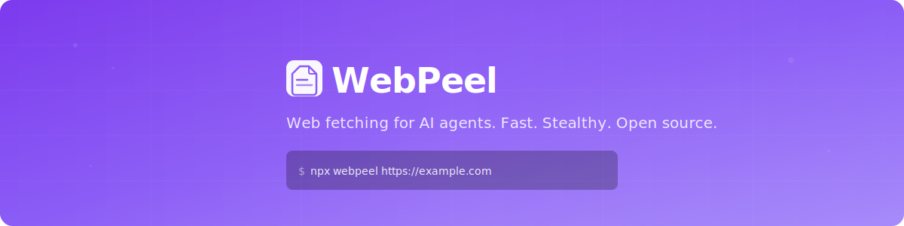

<p align="center">
  <a href="https://webpeel.dev">
    
  </a>
</p>

<p align="center">
  <a href="https://www.npmjs.com/package/webpeel"></a>
  <a href="https://pypi.org/project/webpeel/"></a>
  <a href="https://www.npmjs.com/package/webpeel"></a>
  <a href="https://github.com/webpeel/webpeel/stargazers"></a>
  <a href="https://github.com/webpeel/webpeel/actions/workflows/ci.yml"></a>
  <a href="https://www.typescriptlang.org/"></a>
  <a href="https://www.gnu.org/licenses/agpl-3.0"></a>
</p>

<p align="center">
  <b>Turn any web page into AI-ready markdown. Smart escalation. Stealth mode. Free to start.</b>
</p>

<p align="center">
  <a href="https://webpeel.dev">Website</a> ·
  <a href="https://webpeel.dev/docs">Docs</a> ·
  <a href="https://webpeel.dev/playground">Playground</a> ·
  <a href="https://app.webpeel.dev">Dashboard</a> ·
  <a href="https://github.com/webpeel/webpeel/discussions">Discussions</a>
</p>

---

## Quick Start

```bash
# Zero install — just run it
npx webpeel https://news.ycombinator.com
```

```bash
# Agent mode — JSON + budget + extraction in one flag
npx webpeel https://example.com --agent

# Site search — no URL knowledge needed (27 supported sites)
npx webpeel search --site ebay "charizard card"
npx webpeel search --site amazon "laptop stand" --table

# CSS schema extraction — auto-detected by domain
npx webpeel https://www.amazon.com/s?k=keyboard --json
npx webpeel https://www.booking.com/searchresults.html --schema booking --json
npx webpeel --list-schemas

# LLM extraction — structured data from any page (BYOK)
npx webpeel https://example.com/product --llm-extract "title, price, rating" --json
npx webpeel https://hn.algolia.com --llm-extract "top 5 posts with scores" --llm-key $OPENAI_API_KEY

# Hotel search — multi-source parallel search
npx webpeel hotels "Paris" --checkin 2026-03-01 --checkout 2026-03-05 --sort price
npx webpeel hotels "New York" --checkin 2026-04-10 --json

# Browser profiles — persistent sessions across requests
npx webpeel profile create myprofile
npx webpeel https://protected-site.com --profile myprofile --stealth
npx webpeel profile list

# Stealth mode (auto-detects & bypasses bot protection)
npx webpeel https://protected-site.com --stealth

# Crawl a website
npx webpeel crawl https://example.com --max-pages 20

# Search the web
npx webpeel search "best AI frameworks 2026"

# Extract product listings automatically
npx webpeel https://store.com/search --extract-all --json
```

First 25 fetches work instantly, no signup. After that, [sign up free](https://app.webpeel.dev/signup) for 125/week.

## Why WebPeel?

| Feature | **WebPeel** | Firecrawl | Jina Reader | MCP Fetch |
|---------|:-----------:|:---------:|:-----------:|:---------:|
| **Free tier** | ✅ 125/wk recurring | 500 one-time | ❌ Cloud only | ✅ Unlimited |
| **Smart escalation** | ✅ HTTP→Browser→Stealth | Manual | ❌ | ❌ |
| **Challenge detection** | ✅ 7 vendors auto-detected | ❌ | ❌ | ❌ |
| **Site search** | ✅ 27 sites built-in | ❌ | ❌ | ❌ |
| **Stealth mode** | ✅ v2, all plans | ✅ | ⚠️ Limited | ❌ |
| **Browser profiles** | ✅ Persistent sessions | ❌ | ❌ | ❌ |
| **Hotel search** | ✅ Multi-source parallel | ❌ | ❌ | ❌ |
| **CSS schema extraction** | ✅ 6 bundled + auto-detect | ❌ | ❌ | ❌ |
| **LLM extraction** | ✅ BYOK, cost tracking | ⚠️ Cloud only | ❌ | ❌ |
| **Firecrawl-compatible** | ✅ Drop-in replacement | ✅ Native | ❌ | ❌ |
| **Self-hosting** | ✅ Docker compose | ⚠️ Complex | ❌ | N/A |
| **Autonomous agent** | ✅ BYOK any LLM | ⚠️ Locked | ❌ | ❌ |
| **MCP tools** | ✅ 11 tools | 3 | 0 | 1 |
| **License** | ✅ AGPL-3.0 | AGPL-3.0 | Proprietary | MIT |
| **Pricing** | **Free / $9 / $29** | $0 / $16 / $83 | Custom | Free |

## Benchmarks

Evaluated on 30 real-world URLs across 6 categories (static, dynamic, SPA, protected, documents, international) against 6 competing web fetching APIs.

| Metric | WebPeel | Next best |
|--------|:-------:|:---------:|
| **Success rate** | **100%** (30/30) | 93.3% (Firecrawl, Exa, LinkUp) |
| **Content quality** | **92.3%** | 83.2% (Exa) |

WebPeel is the only tool that successfully extracted content from all 30 test URLs. Full methodology and per-category breakdown: [webpeel.dev/blog/benchmarks](https://webpeel.dev/blog/benchmarks)

## Install

```bash
# Node.js
npm install webpeel        # or: pnpm add webpeel

# Python
pip install webpeel

# Global CLI
npm install -g webpeel
```

## Usage

### Node.js

```typescript
import { peel } from 'webpeel';

const result = await peel('https://example.com');
console.log(result.content);    // Clean markdown
console.log(result.metadata);   // { title, description, author, ... }
console.log(result.tokens);     // Estimated token count

// With options
const advanced = await peel('https://example.com', {
  render: true,           // Browser for JS-heavy sites
  stealth: true,          // Anti-bot stealth mode
  maxTokens: 4000,        // Limit output
  includeTags: ['main'],  // Filter HTML tags
});
```

### Python

```python
from webpeel import WebPeel

client = WebPeel()  # Free tier, no key needed

result = client.scrape("https://example.com")
print(result.content)  # Clean markdown

results = client.search("python web scraping")
job = client.crawl("https://docs.example.com", limit=100)
```

Zero dependencies. Pure Python 3.8+. [Full SDK docs →](python-sdk/README.md)

### MCP Server

11 tools for Claude Desktop, Cursor, VS Code, and Windsurf:

`webpeel_fetch` · `webpeel_search` · `webpeel_crawl` · `webpeel_map` · `webpeel_extract` · `webpeel_batch` · `webpeel_brand` · `webpeel_change_track` · `webpeel_summarize` · `webpeel_answer` · `webpeel_screenshot`

```json
{
  "mcpServers": {
    "webpeel": {
      "command": "npx",
      "args": ["-y", "webpeel", "mcp"]
    }
  }
}
```

[](https://mcp.so/install/webpeel?for=claude)
[](https://mcp.so/install/webpeel?for=vscode)

> **Where to add this config:** Claude Desktop → `~/Library/Application Support/Claude/claude_desktop_config.json` · Cursor → Settings → MCP Servers · VS Code → `~/.vscode/mcp.json` · Windsurf → `~/.codeium/windsurf/mcp_config.json`

### Docker (Self-Hosted)

```bash
git clone https://github.com/webpeel/webpeel.git
cd webpeel && docker compose up
```

Full API at `http://localhost:3000`. AGPL-3.0 licensed. [Commercial licensing available](mailto:support@webpeel.dev).

## Features

### 🎯 Smart Escalation

Automatically uses the fastest method, escalates only when needed:

```
HTTP Fetch (200ms)  →  Browser Rendering (2s)  →  Stealth Mode (5s)
     80% of sites          15% of sites             5% of sites
```

### 🎭 Stealth Mode

Bypass Cloudflare and bot detection. Masks browser fingerprints, navigator properties, WebGL vendor.

```bash
npx webpeel https://protected-site.com --stealth
```

### 🕷️ Crawl & Map

Crawl websites with link following, sitemap discovery, robots.txt compliance, and deduplication.

```bash
npx webpeel crawl https://docs.example.com --max-pages 100
npx webpeel map https://example.com --max-urls 5000
```

### 🤖 Autonomous Agent (BYOK)

Give it a prompt, it researches the web using your own LLM key.

```bash
npx webpeel agent "Compare pricing of Notion vs Coda" --llm-key sk-...
```

### 📊 More Features

| Feature | CLI | Node.js | Python | API |
|---------|:---:|:-------:|:------:|:---:|
| Structured extraction | ✅ | ✅ | ✅ | ✅ |
| CSS schema extraction | ✅ | ✅ | — | ✅ |
| LLM extraction (BYOK) | ✅ | ✅ | — | ✅ |
| Browser profiles | ✅ | ✅ | — | — |
| Hotel search | ✅ | — | — | — |
| Screenshots | ✅ | ✅ | — | ✅ |
| Branding extraction | ✅ | ✅ | — | — |
| Change tracking | ✅ | ✅ | — | — |
| Token budget | ✅ | ✅ | ✅ | ✅ |
| Tag filtering | ✅ | ✅ | ✅ | ✅ |
| Image extraction | ✅ | ✅ | — | ✅ |
| AI summarization | ✅ | ✅ | — | ✅ |
| Batch processing | — | ✅ | — | ✅ |
| PDF extraction | ✅ | ✅ | — | — |

## Integrations

Works with **LangChain**, **LlamaIndex**, **CrewAI**, **Dify**, and **n8n**. [Integration docs →](https://webpeel.dev/docs)

## Hosted API

Live at [`api.webpeel.dev`](https://api.webpeel.dev) — Firecrawl-compatible endpoints.

```bash
# Fetch a page (free, no auth needed for first 25)
curl "https://api.webpeel.dev/v1/fetch?url=https://example.com"

# With API key
curl "https://api.webpeel.dev/v1/fetch?url=https://example.com" \
  -H "Authorization: Bearer wp_..."
```

### Pricing

| Plan | Price | Weekly Fetches | Burst | Extra Usage |
|------|------:|---------------:|:-----:|:-----------:|
| **Free** | $0 | 125/wk | 25/hr | — |
| **Pro** | $9/mo | 1,250/wk | 100/hr | ✅ from $0.001 |
| **Max** | $29/mo | 6,250/wk | 500/hr | ✅ from $0.001 |

Extra credit costs: fetch $0.002, search $0.001, stealth $0.01. Resets every Monday. All features on all plans. [Compare with Firecrawl →](https://webpeel.dev/migrate-from-firecrawl)

## Project Structure

```
webpeel/
├── src/
│   ├── core/           # Core library (fetcher, strategies, markdown, crawl, search)
│   ├── mcp/            # MCP server (11 tools for AI assistants)
│   ├── server/         # Express API server (hosted version)
│   │   ├── routes/     # API route handlers
│   │   ├── middleware/  # Auth, rate limiting, SSRF protection
│   │   └── premium/    # Server-only premium features
│   ├── tests/          # Vitest test suites
│   ├── cli.ts          # CLI entry point
│   ├── index.ts        # Library exports
│   └── types.ts        # TypeScript type definitions
├── python-sdk/         # Python SDK (PyPI: webpeel)
├── integrations/       # LangChain, LlamaIndex, CrewAI, Dify, n8n
├── site/               # Landing page (webpeel.dev)
├── dashboard/          # Next.js dashboard (app.webpeel.dev)
├── benchmarks/         # Performance comparison suite
└── skills/             # AI agent skills (Claude Code, etc.)
```

## Development

```bash
git clone https://github.com/webpeel/webpeel.git
cd webpeel
npm install && npm run build
npm test
```

See [CONTRIBUTING.md](CONTRIBUTING.md) for guidelines.

## Links

[Documentation](https://webpeel.dev/docs) · [Playground](https://webpeel.dev/playground) · [API Reference](https://webpeel.dev/docs/api-reference) · [npm](https://www.npmjs.com/package/webpeel) · [PyPI](https://pypi.org/project/webpeel/) · [Migration Guide](https://webpeel.dev/migrate-from-firecrawl) · [Blog](https://webpeel.dev/blog) · [Discussions](https://github.com/webpeel/webpeel/discussions)

## Star History

<a href="https://star-history.com/#webpeel/webpeel&Date">
  <picture>
    <source media="(prefers-color-scheme: dark)" srcset="https://api.star-history.com/svg?repos=webpeel/webpeel&type=Date&theme=dark" />
    <source media="(prefers-color-scheme: light)" srcset="https://api.star-history.com/svg?repos=webpeel/webpeel&type=Date" />
    
  </picture>
</a>

## License

This project is licensed under the [GNU Affero General Public License v3.0 (AGPL-3.0)](https://www.gnu.org/licenses/agpl-3.0.html).

**What this means:**
- ✅ Free to use, modify, and distribute
- ✅ Free for personal and commercial use
- ⚠️ If you run a modified version as a network service, you must release your source code under AGPL-3.0

**Need a commercial license?** Contact us at [support@webpeel.dev](mailto:support@webpeel.dev) for proprietary/enterprise licensing.

> **Note:** Versions 0.7.1 and earlier were released under MIT. Those releases remain MIT-licensed.

© [WebPeel](https://github.com/webpeel)

---

<p align="center">
  <b>Like WebPeel?</b> <a href="https://github.com/webpeel/webpeel">⭐ Star us on GitHub</a> — it helps others discover the project!
</p>
